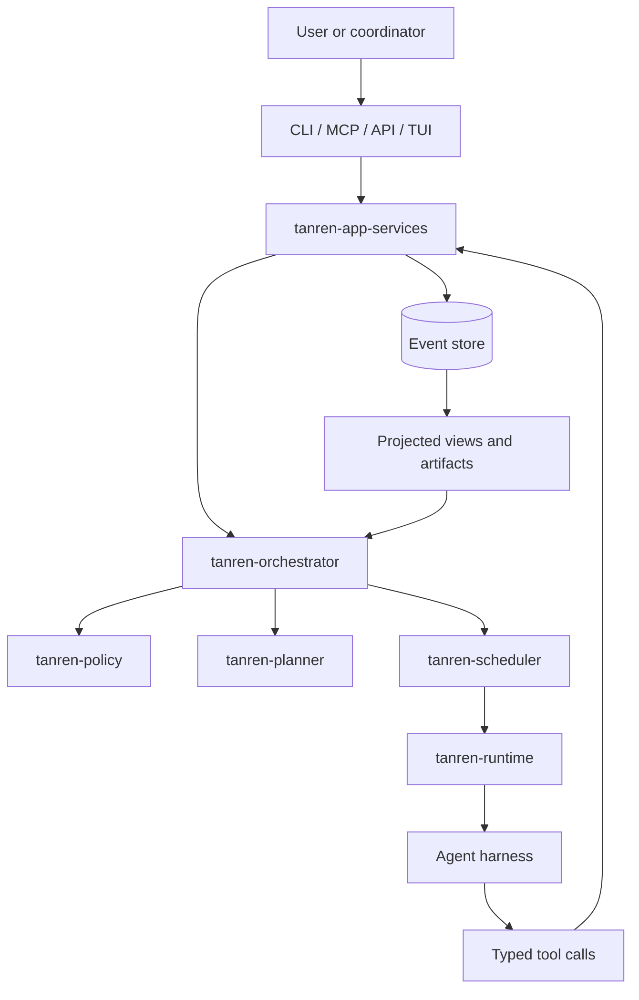
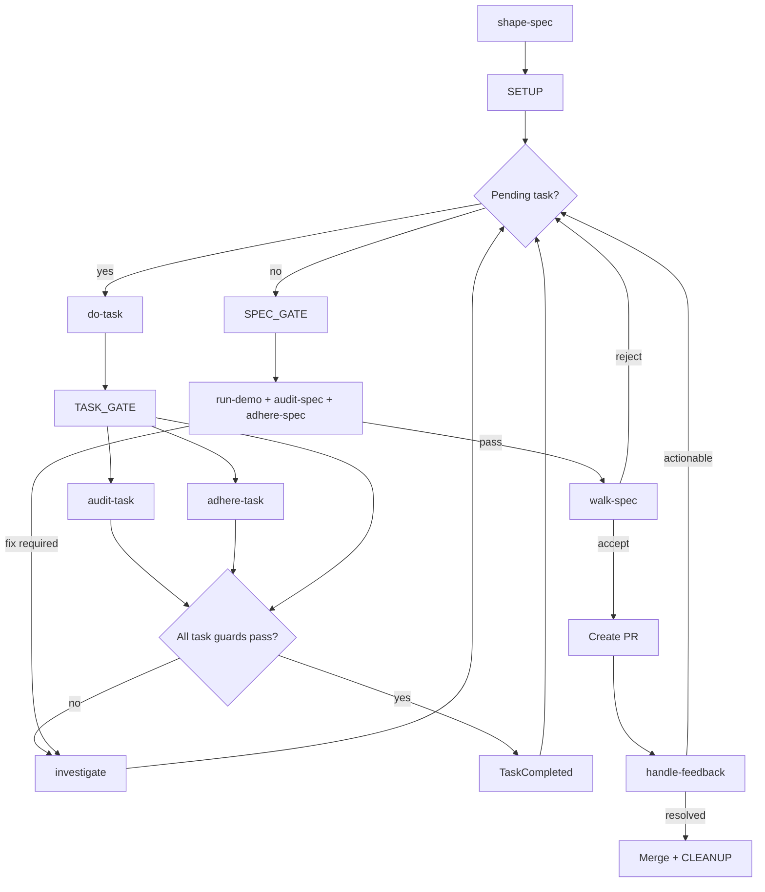
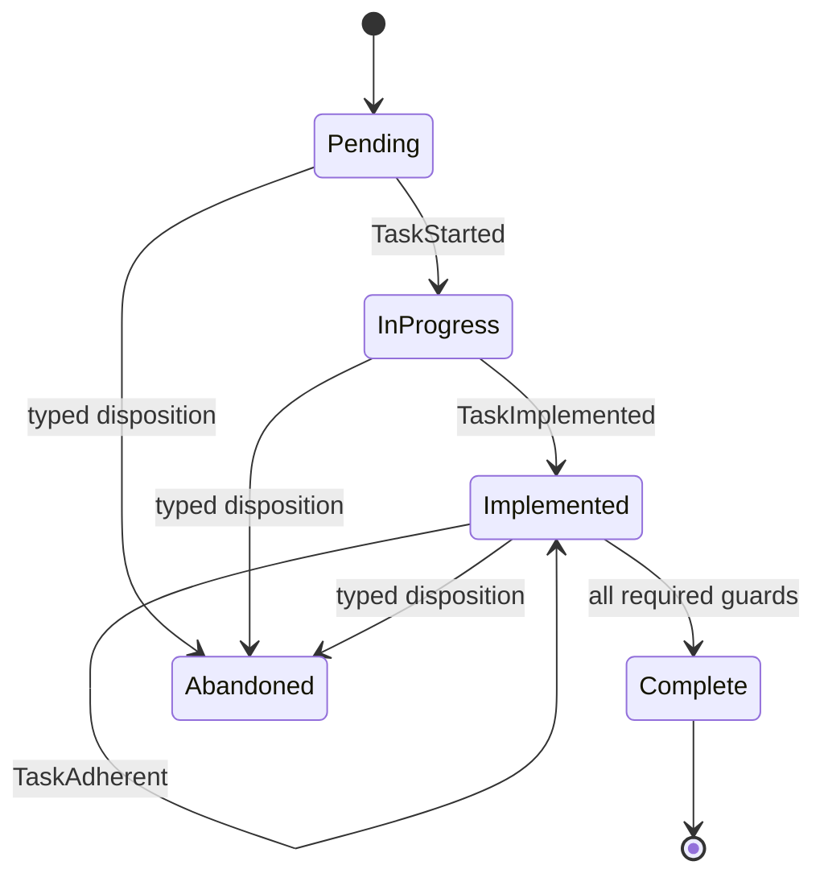
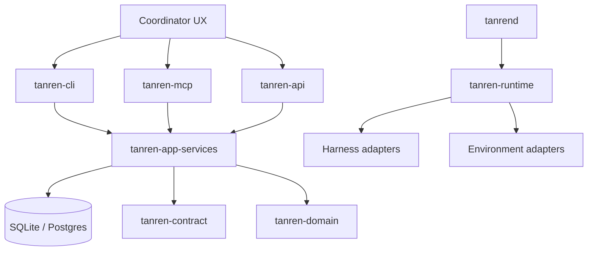

# tanren

Product-to-proof control plane for agentic software delivery.

[](https://github.com/trevorWieland/tanren/actions/workflows/rust-ci.yml)
[](#license)

Tanren is the framework around coding agents that decides what work should
exist, why it matters, what order it should run in, and which evidence proves it
complete. Agent runtimes such as Codex, Claude Code, or OpenCode decide how an
individual role reasons and edits. Tanren owns the product memory and workflow
truth around those agents.

The long-term goal is a continuous chain from product intent to shipped,
evidenced behavior:

```text
product brief
-> accepted behavior catalog
-> roadmap DAG
-> shaped specs
-> orchestrated implementation
-> BDD evidence and human walk
-> PR, review, merge, ship
-> feedback and proactive analysis
-> updated product plan
```

This makes autonomous coding governable. Every increment should be traceable to
accepted product behavior, every asserted behavior should have executable
evidence, and every roadmap milestone should explain what user, operator,
client, or runtime-actor outcomes are now complete.

For the full product vision, read [docs/vision.md](docs/vision.md).

## Quick Start

```bash
git clone https://github.com/trevorWieland/tanren.git
cd tanren
just bootstrap
just install
just ci
```

The canonical installed binaries are `tanren-cli` and `tanren-mcp`.

```bash
scripts/runtime/install-runtime.sh
scripts/runtime/verify-installed-runtime.sh
tanren-cli install --dry-run
```

## Why Tanren Exists

Coding agents can produce changes quickly, but speed without durable product
context creates drift. Tanren exists to prevent common failures:

- work starts from vague tickets rather than agreed product intent;
- roadmaps become stale prose instead of dependency-aware executable plans;
- specs complete implementation tasks without completing user-visible behavior;
- tests prove implementation details but not accepted product outcomes;
- demos and reviews lack a clear behavior story;
- bugs, client requests, and audit findings become scattered interruptions;
- autonomous loops either stop too often or run without typed evidence.

Tanren's answer is opinionated: product behavior is the unit of meaning,
roadmap nodes must complete behavior, specs are shaped before execution, BDD
evidence is the proof path, and agents mutate workflow state only through typed
tools.

## What Tanren Is Not

Tanren is not an agent runtime, model provider, editor, ticket tracker, CI
system, or generic task runner. It integrates with those systems through
adapters. The core responsibility stays the same across integrations: decide
what work happens, preserve why it exists, enforce how it progresses, and keep
evidence for what was proven.

Tanren is pluggable at the edges but not methodology-neutral. It should not
care whether a team uses GitHub or another source-control provider, local
subprocesses or remote VMs, one agent harness or another. It should care that
work is behavior-backed, roadmap-ordered, spec-shaped, audited, walked, and
evidenced.

## What Tanren Empowers

In its complete form, Tanren should let a team answer, from durable state:

- what product is being built and for whom;
- which behaviors are accepted, implemented, asserted, deprecated, or missing;
- what spec-sized work remains and why that order is correct;
- what is currently in flight, blocked, reviewed, or shipped;
- which evidence proves that a behavior exists;
- how bugs, client requests, post-ship outcomes, and proactive analyses changed
  the plan.

That is the difference between "agents can write code" and "agents can help
deliver a product whose intended behaviors are planned, implemented, validated,
reviewed, shipped, and continuously improved."

## Tanren Method

Tanren's method has four product-to-proof layers:

1. **Plan product**: establish the product brief, motivations, target users,
   constraints, success signals, and open product decisions.
2. **Identify behaviors**: turn product intent into a parsable catalog of
   accepted user, operator, client, and runtime-actor behaviors.
3. **Craft roadmap**: synthesize a machine-readable DAG of spec-sized nodes
   that complete accepted behaviors in dependency order. Human-readable
   roadmap documents are rendered views of that graph.
4. **Execute specs**: shape one roadmap node into a spec, orchestrate the task
   loop, run behavior evidence, walk the result with a human, review, merge,
   and update behavior verification state.

Tanren also treats proactive project analysis as a first-class source of
planning input. Scheduled standards sweeps, security audits, mutation-testing
runs, post-ship health checks, and similar non-interactive analyses should
produce findings or proposed planning changes that flow back into behaviors,
roadmap nodes, and shaped specs rather than bypassing the product method.

The spec-orchestration loop is the execution layer, not the whole method.
Without product intent there is no meaningful behavior catalog; without
accepted behaviors there is no reliable roadmap; without a roadmap DAG there is
no principled spec queue; without BDD evidence and walks, completed specs do
not prove product progress.

This repo currently has the real spec-loop commands installed and temporary
project-method bootstrap commands for `plan-product`, `identify-behaviors`, and
`craft-roadmap`. The project-method commands write direct planning artifacts for
now; they are not yet native typed Tanren phases.

## How It Works

Tanren's runtime orchestration model has four layers:

1. **Intent**: a human or coordinator starts a spec, task, dispatch, or
   lifecycle action through CLI, MCP, API, or TUI.
2. **Control plane**: application services validate the request, apply policy,
   call the orchestrator, and persist typed events.
3. **Execution**: scheduler/runtime crates lease an environment and hand one
   phase to an agent harness.
4. **Evidence**: every meaningful state change becomes a typed event and a
   projected artifact, so the next phase has a coherent view of the work.



The core loop is intentionally narrow: agents write implementation and
diagnostic evidence, while Tanren owns state. Agents do not directly edit
orchestrator-owned artifacts such as `plan.md`, `tasks.json`,
`progress.json`, or `phase-events.jsonl`; they call typed tools, and Tanren
projects those files from durable events.

## Orchestration State Machine

The spec loop starts with interactive shaping, runs autonomous task phases
until every task is complete, then validates the whole spec before review and
merge.



Each task advances through a guarded lifecycle:



The full state-machine specification, including cross-spec flows and
escalation rules, lives in
[docs/architecture/orchestration-flow.md](docs/architecture/orchestration-flow.md).

## Architecture



Core crates:

- `tanren-domain`: typed IDs, commands, events, views, policy-neutral state
- `tanren-contract`: interface schemas and request/response contracts
- `tanren-store`: database migrations, event store, projections, and queues
- `tanren-app-services`: application workflows over domain/store/contract
- `tanren-orchestrator`: state transition and dispatch orchestration
- `tanren-planner`: task graph planning and replanning data model
- `tanren-scheduler`: dependency, lane, and capability-aware scheduling
- `tanren-runtime*`: execution contracts and environment substrates
- `tanren-harness-*`: agent-runtime adapters
- `bin/*`: CLI, MCP, API, daemon, and TUI entrypoints

The linking rule is deliberate: transport binaries call application services;
application services call the orchestrator; the orchestrator coordinates
policy, store, planner, scheduler, and runtime boundaries. This keeps direct
store mutation out of CLI/API/MCP handlers and makes state transitions
auditable.

## Repository Structure

```text
tanren/
├── bin/             # Rust binaries
├── crates/          # Rust libraries
├── xtask/           # repo automation and proof-support commands
├── commands/        # source command markdown rendered by the installer
├── profiles/        # standards profiles
├── protocol/        # protocol overview
├── docs/            # architecture, methodology, roadmap
├── tests/bdd/       # behavior feature files
└── scripts/         # shell entrypoints
```

## Development

- Setup: `just bootstrap`
- Static gate: `just check`
- Behavior proof: `just tests`
- Full PR gate: `just ci`
- Auto-fix: `just fix`

Rust CI runs `just ci`. Protected development branches are governed by the
`just ci` status check.

## Documentation

- [docs/README.md](docs/README.md) - documentation index
- [docs/vision.md](docs/vision.md) - product-to-proof vision
- [docs/roadmap/README.md](docs/roadmap/README.md) - roadmap DAG source-of-truth model
- [docs/roadmap/ROADMAP.md](docs/roadmap/ROADMAP.md) - current human-readable roadmap view
- [docs/behaviors/README.md](docs/behaviors/README.md) - product behavior catalog
- [tests/bdd/README.md](tests/bdd/README.md) - executable behavior evidence rules
- [docs/methodology/commands-install.md](docs/methodology/commands-install.md) - command installation contract
- [docs/architecture/overview.md](docs/architecture/overview.md) - architecture overview
- [docs/architecture/agent-tool-surface.md](docs/architecture/agent-tool-surface.md) - tool and CLI fallback contract

## License

Licensed under either of:

- Apache License, Version 2.0 ([LICENSE-APACHE](LICENSE-APACHE))
- MIT license ([LICENSE-MIT](LICENSE-MIT))

at your option.
