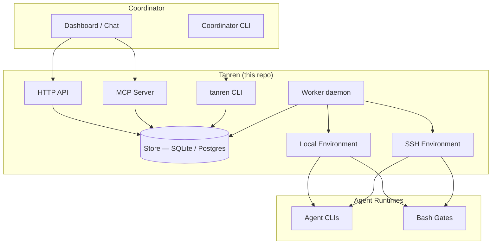

<!-- Replace assets/logo.png with the real tanren logo -->


# tanren

Opinionated orchestration engine for agentic software development.

[](https://github.com/trevorWieland/tanren/actions/workflows/ci.yml)
[](LICENSE)
[](https://python.org)
[](https://github.com/trevorWieland/tanren/releases)

## What is tanren?

Tanren decides **what work happens and in what order** -- issue intake, spec
lifecycle, orchestration, gates, feedback. Agent runtimes decide **how each
role executes** -- CLI selection, model routing, authentication, tooling. This
separation lets you swap agents, models, and coordinators without changing
workflow logic.

## Architecture



**Three-layer model**: Coordinators (identity, authorization, developer UX)
sit above tanren. Tanren manages workflow state, dispatch routing, and
environment lifecycle. Agent runtimes (opencode, codex, claude, aider) sit
below and handle role-specific execution.

## Quick Start

### Run with Docker

```bash
docker run -d --name tanren-api \
  -p 8000:8000 \
  ghcr.io/trevorwieland/tanren-api:latest
```

Health check: `curl http://localhost:8000/api/v1/health`

### Run API + Worker (Docker Compose)

```bash
cp api.env.example api.env && cp daemon.env.example daemon.env
# Edit both env files — at minimum set TANREN_API_API_KEY
docker compose up -d
```

With Postgres: `docker compose --profile postgres up -d`

See `api.env.example` and `daemon.env.example` for the full env var reference.

#### Adapter Requirements

| Adapter | Python Package | Required Env Vars | When |
|---------|---------------|-------------------|------|
| Manual  | *(core)* | *(none)* | `provisioner.type: manual` in remote.yml |
| Hetzner | `hcloud` | `HCLOUD_TOKEN` | `provisioner.type: hetzner` |
| GCP     | `google-cloud-compute` | `GCP_SSH_PUBLIC_KEY` | `provisioner.type: gcp` |

All adapters are included in the default Docker image (`EXTRAS="all"`).
Build with `--build-arg EXTRAS="hetzner"` for a single-adapter image,
or `EXTRAS=""` for no cloud adapters.

### Run with the CLI

```bash
git clone https://github.com/trevorWieland/tanren.git
cd tanren
uv sync
```

Validate your environment:

```bash
tanren env check
```

Run a full lifecycle:

```bash
tanren run full \
  --project my-project \
  --branch main \
  --spec-path tanren/specs/s0001 \
  --phase do-task
```

### Install methodology into a project

```bash
cd /path/to/your-project
/path/to/tanren/scripts/install.sh --profile python-uv
```

This installs commands, standards, product templates, and helper scripts.
Then bootstrap project knowledge (run once per project, via your agent):

1. `plan-product`
2. `discover-standards`
3. `inject-standards`
4. `index-standards`

See [docs/getting-started/bootstrap.md](docs/getting-started/bootstrap.md)
for the full bootstrap flow.

## Features

- **Spec lifecycle orchestration** -- shape, implement, audit, gate, and
  feedback phases with automatic retries and dependency tracking
- **Multi-agent dispatch** -- routes work to opencode, codex, claude, or
  bash based on role configuration
- **Local and remote execution** -- run agents locally via subprocess or on
  remote VMs over SSH (Hetzner, GCP)
- **Methodology system** -- reusable commands, coding standards profiles, and
  product context templates installed into target projects
- **Multiple entry points** -- HTTP API, MCP server, and CLI for flexible
  coordinator integration
- **Gate checks** -- automated validation between phases with configurable
  per-phase gate commands
- **Event tracking** -- structured event emission to SQLite or Postgres for
  observability and metering

## What Tanren Is

Tanren has two coupled halves:

1. **Execution framework** (`packages/tanren-core/`, `services/`): dispatch
   routing, environment provisioning, retries, lifecycle handling, and result
   emission.
2. **Methodology system** (`commands/`, `profiles/`, `templates/`):
   reusable agent instructions, standards, and product context.

## What Tanren Is Not

- Not a model router or model chooser
- Not tied to one coordinator UX (dashboard/CLI/chat can all sit above tanren)
- Not a vendor-locked hosted platform

## Repository Structure

```text
tanren/
├── commands/        # 15 workflow command files
├── profiles/        # standards profiles (default, python-uv)
├── templates/       # product/audit/bootstrap templates
├── packages/
│   └── tanren-core/ # core orchestration library
├── services/
│   ├── tanren-api/  # HTTP API (FastAPI)
│   ├── tanren-cli/  # CLI tool
│   └── tanren-daemon/ # worker manager daemon
├── protocol/        # protocol overview
├── docs/            # architecture, workflow, ops, roadmap
└── scripts/         # install and utility scripts
```

## Configuration

- **Developer-scoped**: local auth, secrets, preferences (never committed)
- **Project-scoped**: `tanren.yml`, standards, product docs (committed per-repo)
- **Organization-scoped**: runtime policy and infrastructure config

## Documentation

- [docs/README.md](docs/README.md) - documentation index
- [docs/architecture/overview.md](docs/architecture/overview.md) - architecture and boundaries
- [docs/workflow/spec-lifecycle.md](docs/workflow/spec-lifecycle.md) - lifecycle and orchestration rules
- [docs/getting-started/bootstrap.md](docs/getting-started/bootstrap.md) - install/bootstrap flow
- [docs/operations/security-secrets.md](docs/operations/security-secrets.md) - security and secret handling
- [docs/operations/observability.md](docs/operations/observability.md) - events and metering
- [docs/interfaces.md](docs/interfaces.md) - CLI, library, and store interaction surfaces
- [docs/design-principles.md](docs/design-principles.md) - architectural principles
- [docs/roadmap.md](docs/roadmap.md) - date-stamped roadmap
- [protocol/README.md](protocol/README.md) - protocol overview
- [docs/worker-README.md](docs/worker-README.md) - worker architecture and operations
- [docs/ADAPTERS.md](docs/ADAPTERS.md) - adapter architecture and extension points

## Contributing

See [CONTRIBUTING.md](CONTRIBUTING.md) for development setup and guidelines.

## License

Apache License 2.0. See [LICENSE](LICENSE) for full text.
