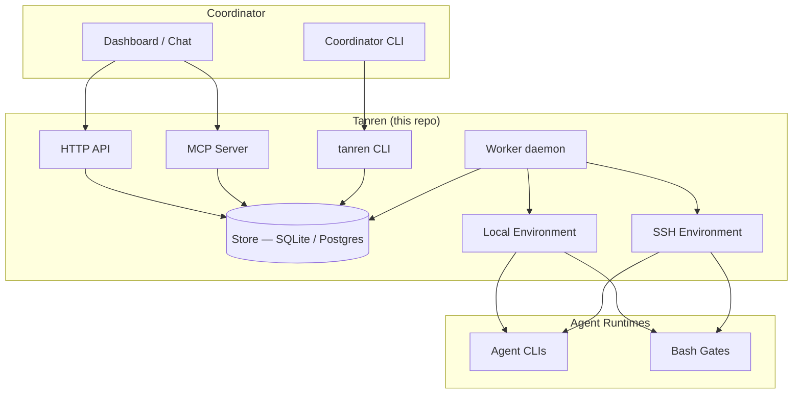

<!-- Replace assets/logo.png with the real tanren logo -->


# tanren

Opinionated orchestration engine for agentic software development.

[](https://github.com/trevorWieland/tanren/actions/workflows/ci.yml)
[](LICENSE)
[](https://python.org)
[](https://github.com/trevorWieland/tanren/releases)

## What is tanren?

Tanren decides **what work happens and in what order** -- issue intake, spec
lifecycle, orchestration, gates, feedback. Agent runtimes decide **how each
role executes** -- CLI selection, model routing, authentication, tooling. This
separation lets you swap agents, models, and coordinators without changing
workflow logic.

## Architecture



**Three-layer model**: Coordinators (identity, authorization, developer UX)
sit above tanren. Tanren manages workflow state, dispatch routing, and
environment lifecycle. Agent runtimes (opencode, codex, claude, aider) sit
below and handle role-specific execution.

## Quick Start (Canonical Runtime Contract)

The acceptance runtime contract is installed binaries only:
`tanren-cli` and `tanren-mcp`.

```bash
git clone https://github.com/trevorWieland/tanren.git
cd tanren
scripts/runtime/install-runtime.sh
scripts/runtime/verify-installed-runtime.sh
tanren-cli install --dry-run
```

Canonical install/operator docs:
- [docs/methodology/commands-install.md](docs/methodology/commands-install.md)
- [docs/architecture/install-targets.md](docs/architecture/install-targets.md)
- [docs/rewrite/PHASE0_PROOF_RUNBOOK.md](docs/rewrite/PHASE0_PROOF_RUNBOOK.md)

Secure MCP startup is fail-closed and requires issuer/audience/key/ttl
contract in `tanren.yml` (`methodology.mcp.security`) plus per-phase
runtime envelope injection (`TANREN_MCP_CAPABILITY_ENVELOPE`).

Legacy Python-era bootstrap guidance is retained only as historical
context and is not the Phase 0 acceptance path.

## Features

- **Spec lifecycle orchestration** -- shape, implement, audit, gate, and
  feedback phases with automatic retries and dependency tracking
- **Multi-agent dispatch** -- routes work to opencode, codex, claude, or
  bash based on role configuration
- **Local and remote execution** -- run agents locally via subprocess or on
  remote VMs over SSH (Hetzner, GCP)
- **Methodology system** -- reusable commands, coding standards profiles, and
  product context templates installed into target projects
- **Multiple entry points** -- HTTP API, MCP server, and CLI for flexible
  coordinator integration
- **Gate checks** -- automated validation between phases with configurable
  per-phase gate commands
- **Event tracking** -- structured event emission to SQLite or Postgres for
  observability and metering

## What Tanren Is

Tanren has two coupled halves:

1. **Execution framework** (`packages/tanren-core/`, `services/`): dispatch
   routing, environment provisioning, retries, lifecycle handling, and result
   emission.
2. **Methodology system** (`commands/`, `profiles/`, `templates/`):
   reusable agent instructions, standards, and product context.

## What Tanren Is Not

- Not a model router or model chooser
- Not tied to one coordinator UX (dashboard/CLI/chat can all sit above tanren)
- Not a vendor-locked hosted platform

## Repository Structure

```text
tanren/
├── commands/        # 15 workflow command files
├── profiles/        # standards profiles (default, python-uv)
├── templates/       # product/audit/bootstrap templates
├── packages/
│   └── tanren-core/ # core orchestration library
├── services/
│   ├── tanren-api/  # HTTP API (FastAPI)
│   ├── tanren-cli/  # CLI tool
│   └── tanren-daemon/ # worker manager daemon
├── protocol/        # protocol overview
├── docs/            # architecture, workflow, ops, roadmap
└── scripts/         # install and utility scripts
```

## Configuration

- **Developer-scoped**: local auth, secrets, preferences (never committed)
- **Project-scoped**: `tanren.yml`, standards, product docs (committed per-repo)
- **Organization-scoped**: runtime policy and infrastructure config

## Documentation

- [docs/README.md](docs/README.md) - documentation index
- [docs/methodology/commands-install.md](docs/methodology/commands-install.md) - canonical install contract (`tanren-cli install`)
- [docs/architecture/install-targets.md](docs/architecture/install-targets.md) - render targets, merge policy, MCP env contract
- [docs/architecture/agent-tool-surface.md](docs/architecture/agent-tool-surface.md) - typed tool and CLI fallback contract
- [docs/rewrite/PHASE0_PROOF_RUNBOOK.md](docs/rewrite/PHASE0_PROOF_RUNBOOK.md) - Phase 0 proof procedure
- [docs/rewrite/PHASE1_PROOF_BDD.md](docs/rewrite/PHASE1_PROOF_BDD.md) - Phase 1 behavior/invariants
- [docs/architecture/overview.md](docs/architecture/overview.md) - system architecture

## Contributing

See [CONTRIBUTING.md](CONTRIBUTING.md) for development setup and guidelines.

## License

Apache License 2.0. See [LICENSE](LICENSE) for full text.
