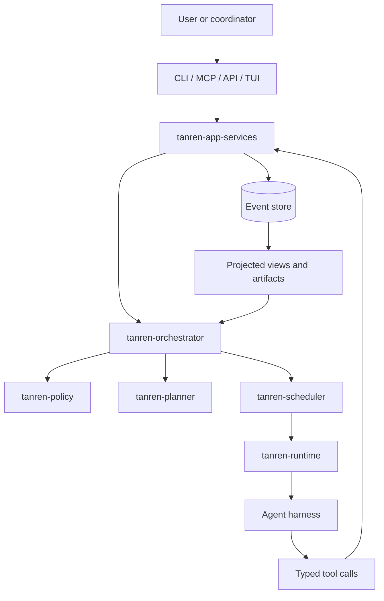
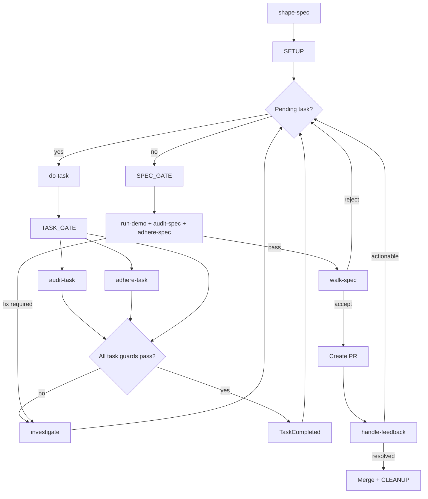
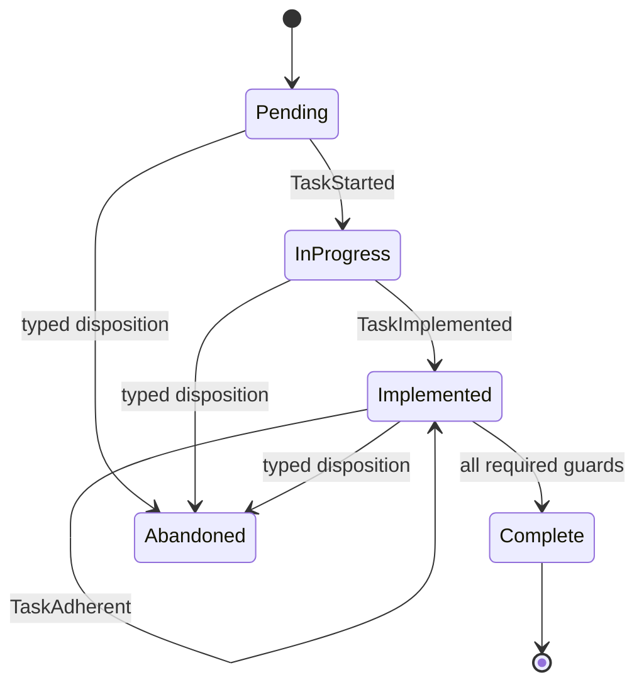
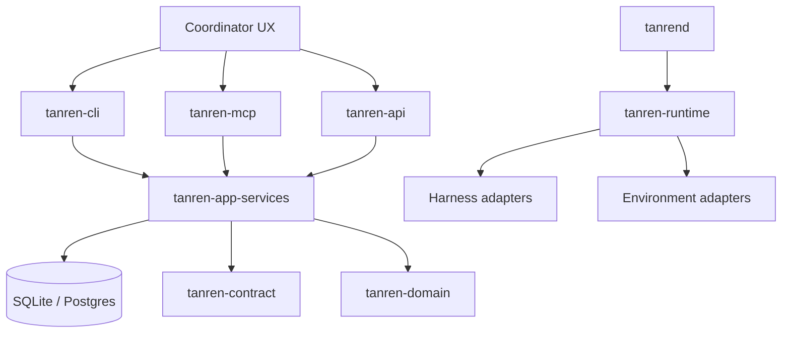

# tanren

Rust code-orchestration framework for agentic software delivery.

[](https://github.com/trevorWieland/tanren/actions/workflows/rust-ci.yml)
[](#license)

Tanren decides what work happens, in what order, under which policy and
runtime constraints. Agent runtimes decide how each role executes. This keeps
workflow state, evidence, installation, and execution contracts in one typed
Rust control plane while allowing harnesses and environments to vary.

Tanren is not an agent runtime. It is the framework around agent runtimes:
it shapes work into specs and tasks, dispatches the right phase, enforces
state transitions through typed tools, records durable evidence, and loops
until the configured gates are satisfied or a human decision is required.

## Quick Start

```bash
git clone https://github.com/trevorWieland/tanren.git
cd tanren
just bootstrap
just install
just ci
```

The canonical installed binaries are `tanren-cli` and `tanren-mcp`.

```bash
scripts/runtime/install-runtime.sh
scripts/runtime/verify-installed-runtime.sh
tanren-cli install --dry-run
```

## How It Works

Tanren's orchestration model has four layers:

1. **Intent**: a human or coordinator starts a spec, task, dispatch, or
   lifecycle action through CLI, MCP, API, or TUI.
2. **Control plane**: application services validate the request, apply policy,
   call the orchestrator, and persist typed events.
3. **Execution**: scheduler/runtime crates lease an environment and hand one
   phase to an agent harness.
4. **Evidence**: every meaningful state change becomes a typed event and a
   projected artifact, so the next phase has a coherent view of the work.



The core loop is intentionally narrow: agents write implementation and
diagnostic evidence, while Tanren owns state. Agents do not directly edit
orchestrator-owned artifacts such as `plan.md`, `tasks.json`,
`progress.json`, or `phase-events.jsonl`; they call typed tools, and Tanren
projects those files from durable events.

## Orchestration State Machine

The spec loop starts with interactive shaping, runs autonomous task phases
until every task is complete, then validates the whole spec before review and
merge.



Each task advances through a guarded lifecycle:



The full state-machine specification, including cross-spec flows and
escalation rules, lives in
[docs/architecture/orchestration-flow.md](docs/architecture/orchestration-flow.md).

## Architecture



Core crates:

- `tanren-domain`: typed IDs, commands, events, views, policy-neutral state
- `tanren-contract`: interface schemas and request/response contracts
- `tanren-store`: database migrations, event store, projections, and queues
- `tanren-app-services`: application workflows over domain/store/contract
- `tanren-orchestrator`: state transition and dispatch orchestration
- `tanren-planner`: task graph planning and replanning data model
- `tanren-scheduler`: dependency, lane, and capability-aware scheduling
- `tanren-runtime*`: execution contracts and environment substrates
- `tanren-harness-*`: agent-runtime adapters
- `bin/*`: CLI, MCP, API, daemon, and TUI entrypoints

The linking rule is deliberate: transport binaries call application services;
application services call the orchestrator; the orchestrator coordinates
policy, store, planner, scheduler, and runtime boundaries. This keeps direct
store mutation out of CLI/API/MCP handlers and makes state transitions
auditable.

## Repository Structure

```text
tanren/
├── bin/             # Rust binaries
├── crates/          # Rust libraries
├── xtask/           # repo automation and proof-support commands
├── commands/        # source command markdown rendered by the installer
├── profiles/        # standards profiles
├── protocol/        # protocol overview
├── docs/            # architecture, methodology, roadmap
├── tests/bdd/       # behavior feature files
└── scripts/         # shell entrypoints
```

## Development

- Setup: `just bootstrap`
- Static gate: `just check`
- Behavior proof: `just tests`
- Full PR gate: `just ci`
- Auto-fix: `just fix`

Rust CI runs `just ci`. Protected development branches are governed by the
`just ci` status check.

## Documentation

- [docs/README.md](docs/README.md) - documentation index
- [docs/roadmap/README.md](docs/roadmap/README.md) - product roadmap suite
- [docs/roadmap/ROADMAP.md](docs/roadmap/ROADMAP.md) - phase roadmap
- [docs/behaviors/README.md](docs/behaviors/README.md) - product behavior catalog
- [tests/bdd/README.md](tests/bdd/README.md) - executable behavior evidence rules
- [docs/methodology/commands-install.md](docs/methodology/commands-install.md) - command installation contract
- [docs/architecture/overview.md](docs/architecture/overview.md) - architecture overview
- [docs/architecture/agent-tool-surface.md](docs/architecture/agent-tool-surface.md) - tool and CLI fallback contract

## License

Licensed under either of:

- Apache License, Version 2.0 ([LICENSE-APACHE](LICENSE-APACHE))
- MIT license ([LICENSE-MIT](LICENSE-MIT))

at your option.
