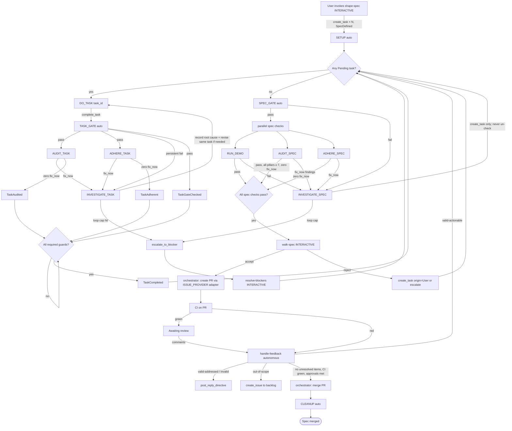
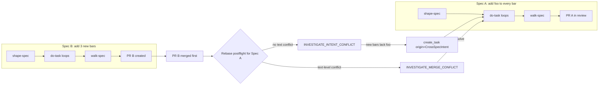
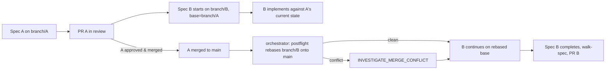

# Orchestration Flow

Authoritative spec for the Tanren methodology orchestration state machine.
Defines phases, transitions, failure routing, escalation, monotonicity
invariants, and cross-spec concerns.

Companion docs: [agent-tool-surface.md](agent-tool-surface.md),
[evidence-schemas.md](evidence-schemas.md),
[audit-rubric.md](audit-rubric.md),
[adherence.md](adherence.md),
[phase-taxonomy.md](phase-taxonomy.md).

---

## 1. Phase classification

### 1.1 Spec-orchestration loop (participates in the typed state machine)

**Agentic phases:**
- `shape-spec` — interactive spec shaping
- `do-task` — autonomous task implementation
- `audit-task` — autonomous task-level opinionated rubric audit
- `adhere-task` — autonomous task-level standards-compliance check
- `run-demo` — autonomous demo execution
- `audit-spec` — autonomous spec-level opinionated rubric audit
- `adhere-spec` — autonomous spec-level standards-compliance check
- `walk-spec` — interactive user validation walkthrough
- `handle-feedback` — autonomous post-PR review triage
- `investigate` — autonomous escalation diagnosis
- `resolve-blockers` — interactive final-escalation resolution

**Automated phases:**
- `SETUP` — environment provisioning
- `TASK_GATE` — automated task-level gate (`{{TASK_VERIFICATION_HOOK}}`)
- `SPEC_GATE` — automated spec-level gate (`{{SPEC_VERIFICATION_HOOK}}`)
- `CLEANUP` — environment teardown

### 1.2 Project-management (out-of-loop)

Commands under `commands/project/` do NOT participate in the typed state
machine. There are currently no active project command sources.

Product-method commands such as `plan-product`, `identify-behaviors`, and
`craft-roadmap` are intentionally not listed here until fresh command contracts
exist. They belong above the spec-orchestration loop and should feed shaped
specs through a roadmap DAG rather than mutate active task lists directly.
Future project-analysis commands for scheduled standards sweeps, security
audits, mutation-testing review, and health checks should likewise enter through
typed findings or planning-change proposals before producing spec work.

### 1.3 Interactive surface

Exactly three spec-loop phases pause for a human:
- `shape-spec`
- `walk-spec`
- `resolve-blockers`

Future project-management commands may also pause for human approval or
authoring. All other spec-loop phases are autonomous. The escalation ladder
(§5) guarantees human intervention is rare and purposeful.

---

## 2. Task lifecycle

### 2.1 States

```
              Pending
                │
                ▼ TaskStarted
           InProgress
                │
                ▼ TaskImplemented
          Implemented
                │
        ┌───────┼──────────┬────────────┐
        │       │          │            │ (parallel, any order)
        ▼       ▼          ▼            ▼
  TaskGateChecked TaskAudited TaskAdherent TaskXChecked …
        │       │          │            │
        └───────┴────┬─────┴────────────┘
                     │ (all required guards satisfied)
                     ▼ TaskCompleted
                  Complete

  Abandoned (side branch from any non-terminal state)
```

### 2.2 Invariants

- `Complete` is **terminal**. No event may transition out of it.
- `Abandoned` requires a typed disposition:
  `replacement` (with non-empty replacement task ids) or
  `explicit_user_discard` (with typed `resolve-blockers` provenance).
- Required-guard set is config-defined:
  ```yaml
  methodology:
    task_complete_requires: [gate_checked, audited, adherent]
  ```
  Extra guards resolve through
  `methodology.variables.task_check_hook_<guard_name>`; missing hook
  for a required extra guard is a hard configuration error.
- Guards are evaluated as one **task-check batch** per attempt:
  gate, audit, adherence, and any required extras all execute before
  routing to `investigate`.
- Any failed check in a batch emits `TaskGuardsReset` before
  `investigate`, clearing `gate_checked`, `audited`, `adherent`, and
  all extra guard flags for the task.
- State mutations happen exclusively through
  `tanren-app-services::methodology::service`. Direct store writes
  are forbidden by the linking rule.

### 2.3 Task origin provenance

Every `TaskCreated` event carries a typed `TaskOrigin`:

```
ShapeSpec
Investigation { source_phase, source_task?, loop_index }
Audit { source_phase, source_task?, source_finding }
Adherence { source_standard, source_finding }
Demo { source_run, source_finding }
Feedback { source_pr_comment_ref }
SpecAudit { source_finding }
SpecInvestigation { source_phase, source_finding }
CrossSpecIntent { source_spec_id, source_finding }
CrossSpecMerge { source_spec_id }
User
```

Replaces `plan.md` checkbox mutation. History stays monotonic and
honest: every new task declares why it exists.

### 2.4 Monotonicity

- `Complete` cannot be reopened.
- `revise_task` works only on non-terminal tasks and mutates
  description / acceptance criteria only; does not transition state.
- Task-scoped failures never create tasks. `investigate` records
  root cause and repair context, then `do-task` repairs the same task.
- Every spec-level failure (`RUN_DEMO` fail, `AUDIT_SPEC` fix_now,
  `ADHERE_SPEC` fix_now, `SPEC_GATE` fail, feedback-driven fix)
  routes through `investigate`; spec-scoped investigation may
  materialize new tasks and completed tasks are never un-checked.

---

## 3. Canonical single-spec flow



---

## 4. Cross-spec flows

### 4.1 Parallel specs with merge / intent conflict



**Intent-conflict detection** uses
`spec.acceptance_criteria` + `spec.touched_symbols` (new typed fields
on `SpecFrontmatter`). The current event model records the typed inputs; the
resolution engine lands in Phase 2+.

### 4.2 Stacked-diff dependent specs



`Spec` records `base_branch` and `depends_on_spec_ids` in the
`SpecDefined` event. Rebase orchestration lands in Phase 2+.

---

## 5. Escalation ladder

| Level | Trigger | Owner | Action |
|---|---|---|---|
| 0 | Transient failure (network, timeout, rate limit) | Worker | Retry ≤ 3 with 10/30/60s backoff; fresh session each retry |
| 1 | Persistent phase failure | Orchestrator | Dispatch `investigate` in same scope |
| 2 | `investigate` loop cap hit | `investigate` | Emits `escalate_to_blocker(reason, options)` |
| 3 | Blocker halt | User | Runs `resolve-blockers`; orchestrator resumes |

**Root-cause signature** for loop cap:
`sha256(failing_phase || task_id || normalized_error_fingerprint)`.
Different fingerprint = counter reset. Same fingerprint increments.
Default cap = 3.

**Escalation confinement:** `escalate_to_blocker` is callable only
from `investigate`. Enforced via the tool capability scope
(§agent-tool-surface). Other phases lack the capability; attempting
to call it returns `CapabilityDenied`.

---

## 6. Phase outcome contract

Every agentic phase session ends with one of:
- **Complete + `report_phase_outcome(complete)`** — normal exit,
  orchestrator records success.
- **Complete without `report_phase_outcome`** — lenient default:
  `Implemented` for do-task, `Complete` for other phases, conditional
  on downstream gate/audit agreement.
- **Non-zero exit** — `Error` outcome regardless of tool calls;
  routes to `investigate`.
- **Explicit `blocked`** — routes to `investigate` (not directly to
  human).
- **Explicit `escalate_to_blocker`** (investigate-only) — halts
  orchestration pending `resolve-blockers`.

**Task-check failure evidence contract:** when any task check in a
batch fails, orchestrator writes an investigation bundle containing
the full untruncated logs for every check attempt plus a failed-check
index. The investigate prompt receives the bundle index path; the next
`do-task` retry prompt receives the latest recovery-context pointer.

**Retry semantics:** All retries are **fresh sessions**. No resume.
Prompt caching keeps fresh-session cost low. Retry context includes
the previous failure's narrative + any revised task description from
the investigate session.

---

## 7. Artifact edit enforcement

Orchestrator-owned files (`spec.md`, `plan.md`, `tasks.md`,
`tasks.json`, `demo.md`, `audit.md`, `signposts.md`, `progress.json`,
`.tanren-generated-artifacts.json`, `.tanren-projection-checkpoint.json`,
`phase-events.jsonl`) cannot be edited by agents.
`phase-events.jsonl` is append-only via typed tools, and appended lines
must exactly match projected outbox rows for the active session.
Three-layer
enforcement:

1. **Prompt banner** — `{{READONLY_ARTIFACT_BANNER}}` renders
   into every agent prompt:
   > ⚠️ The following files are orchestrator-owned. Any edits will
   > be reverted and recorded as an `UnauthorizedArtifactEdit` event:
   > spec.md, plan.md, tasks.md, tasks.json, demo.md, progress.json,
   > and the generated-artifacts manifest. `phase-events.jsonl`
   > appends are only
   > accepted when they match service-projected outbox events.
2. **Filesystem `chmod 0444`** — set on agent session start for
   read-only artifacts (`spec.md`, `plan.md`, `tasks.md`, `tasks.json`,
   `demo.md`, `audit.md`, `signposts.md`, `progress.json`,
   `.tanren-generated-artifacts.json`, `.tanren-projection-checkpoint.json`,
   generated indexes); append-only artifacts keep write mode so orchestrator
   outbox projection can append.
3. **Postflight diff + auto-revert** — diff each file against its
   pre-phase snapshot; mismatches are reverted and emit
   `UnauthorizedArtifactEdit { file, diff_preview, phase, agent_session }`.

`investigation-report.json` is tool-authored and session-writable.
Generated orchestrator-owned artifacts are fully projected and
overwritten deterministically from events.

---

## 8. Dispatch lifecycle integration

The methodology orchestration flow composes with dispatch CRUD:

- Each phase is one `Dispatch` (existing dispatch entity from
  `tanren-domain`).
- Dispatch `phase` field identifies which command runs.
- Dispatch `context` carries the resolved inputs for the command:
  spec folder, task_id, diff_range, PR number, review-thread context,
  resolved verification hook, resolved MCP config path.
- Dispatch outcome events from Lane 0.4 (`DispatchCompleted`,
  `DispatchFailed`, `DispatchCancelled`, `DispatchTimeout`) chain into
  the task state machine via the orchestrator's transition rules.

---

## 9. Transition rules (authoritative table)

| From state | Event | To state | Guard |
|---|---|---|---|
| Pending | TaskStarted | InProgress | phase = do-task |
| InProgress | TaskImplemented | Implemented | phase = do-task outcome = complete |
| Implemented | TaskGateChecked | Implemented+gate_checked | gate outcome = pass |
| Implemented | TaskAudited | Implemented+audited | audit outcome = pass, zero fix_now |
| Implemented | TaskAdherent | Implemented+adherent | adherence outcome = pass, zero fix_now |
| Implemented | TaskXChecked(guard) | Implemented+guard | guard outcome = pass |
| Implemented+(all required) | TaskCompleted | Complete | — |
| * (non-terminal) | TaskAbandoned | Abandoned | typed disposition + required provenance |
| * (non-terminal) | TaskRevised | same state | mutates description only |

All other event/state pairs are illegal and rejected by the service
with `IllegalTaskTransition { from, event }`.

---

## 10. See also

- Tool surface that drives these transitions:
  [agent-tool-surface.md](agent-tool-surface.md)
- Evidence schemas produced at each phase:
  [evidence-schemas.md](evidence-schemas.md)
- Audit rubric semantics: [audit-rubric.md](audit-rubric.md)
- Adherence semantics: [adherence.md](adherence.md)
- Phase taxonomy (execution mode, intent, scope):
  [phase-taxonomy.md](phase-taxonomy.md)
